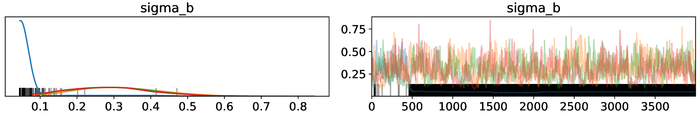

# Symbolic PyMC

[](https://travis-ci.org/pymc-devs/symbolic-pymc) [](https://coveralls.io/github/pymc-devs/symbolic-pymc?branch=master)


Symbolic PyMC provides tools for the symbolic manipulation of [PyMC](https://github.com/pymc-devs) models and their underlying computational graphs.  It enables graph manipulations in the relational DSL [miniKanren](http://minikanren.org/)&mdash;via the [`kanren`](https://github.com/logpy/logpy) package&mdash;by way of meta classes and S-expression forms of a graph.

This work stems from a series of articles starting [here](https://brandonwillard.github.io/a-role-for-symbolic-computation-in-the-general-estimation-of-statistical-models.html).

*This package is currently in alpha, so expect large-scale changes at any time!*

## Features

### General

* Full [miniKanren](http://minikanren.org/) integration for relational graph/model manipulation.
  - Perform simple and robust "search and replace" over arbitrary graphs (e.g. Python builtin collections, AST, tensor algebra graphs, etc.)
  - Create and compose relations with explicit high-level statistical/mathematical meaning and functionality, such as "`X` is a normal scale mixture with mixing distribution `Y`", and automatically "solve" for components (i.e. `X` and `Y`) that satisfy a relation.
  - Apply non-trivial conditions&mdash;as relations&mdash;to produce sophisticated graph manipulations (e.g. search for normal scale mixtures and scale a term in the mixing distribution).
  - Integrate standard Python operations into relations (e.g. use a symbolic math library to compute an inverse-Laplace transform to determine if a distribution is a scale mixture&mdash;and find its mixing distribution).
* Convert graphs to an S-expression-like tuple-based form and perform manipulations at the syntax level.
* Pre-built example relations for symbolic closed-form posteriors and standard statistical model reformulations.

### [Theano](https://github.com/Theano/Theano)

* A more robust Theano `Op` for representing random variables
* Conversion of PyMC3 models into sample-able Theano graphs representing all random variable inter-dependencies
* A LaTeX pretty printer that displays shape information and distributions in mathematical notation

### [TensorFlow](https://github.com/tensorflow/tensorflow)

* TensorFlow graph support
* [In progress] PyMC4 model conversion

## Installation

The package name is `symbolic_pymc` and it can be installed with `pip` directly from GitHub
```shell
$ pip install git+https://github.com/pymc-devs/symbolic-pymc
```
or after cloning the repo (and then installing with `pip`).

## Examples
### Compute Symbolic Closed-form Posteriors

```python
import numpy as np

import theano
import theano.tensor as tt

import pymc3 as pm

from unification import var

from kanren import run

from symbolic_pymc.theano.printing import tt_pprint
from symbolic_pymc.theano.pymc3 import model_graph

from symbolic_pymc.relations.theano import tt_graph_applyo
from symbolic_pymc.relations.theano.conjugates import conjugate

theano.config.cxx = ''
theano.config.compute_test_value = 'ignore'

a_tt = tt.vector('a')
R_tt = tt.matrix('R')
F_t_tt = tt.matrix('F')
V_tt = tt.matrix('V')

a_tt.tag.test_value = np.r_[1., 0.]
R_tt.tag.test_value = np.diag([10., 10.])
F_t_tt.tag.test_value = np.c_[-2., 1.]
V_tt.tag.test_value = np.diag([0.5])

y_tt = tt.as_tensor_variable(np.r_[-3.])
y_tt.name = 'y'

with pm.Model() as model:

    # A normal prior
    beta_rv = pm.MvNormal('beta', a_tt, R_tt, shape=(2,))

    # An observed random variable using the prior as a regression parameter
    E_y_rv = F_t_tt.dot(beta_rv)
    Y_rv = pm.MvNormal('Y', E_y_rv, V_tt, observed=y_tt)

# Create a graph for the model
fgraph = model_graph(model, output_vars=[Y_rv])


def conjugate_graph(graph):
    """Apply conjugate relations throughout a graph."""
    expr_graph, = run(1, var('q'),
                      (tt_graph_applyo, conjugate, graph, var('q')))

    fgraph_opt = expr_graph.eval_obj
    fgraph_opt_tt = fgraph_opt.reify()
    return fgraph_opt_tt


fgraph_conj = conjugate_graph(fgraph.outputs[0])
```

Before:
```python
>>> print(tt_pprint(fgraph))
F in R**(N^F_0 x N^F_1), a in R**(N^a_0), R in R**(N^R_0 x N^R_1)
V in R**(N^V_0 x N^V_1)
beta ~ N(a, R) in R**(N^beta_0), Y ~ N((F * beta), V) in R**(N^Y_0)
Y = [-3.]
```

After:
```python
>>> print(tt_pprint(fgraph_conj))
a in R**(N^a_0), R in R**(N^R_0 x N^R_1), F in R**(N^F_0 x N^F_1)
c in R**(N^c_0 x N^c_1), d in R**(N^d_0 x N^d_1)
V in R**(N^V_0 x N^V_1), e in R**(N^e_0 x N^e_1)
b ~ N((a + (((R * F.T) * c) * ([-3.] - (F * a)))), (R - ((((R * F.T) * d) * (V + (F * (R * F.T)))) * ((R * F.T) * e).T))) in R**(N^b_0)
b
```

### Automatic Re-centering and Re-scaling

We can automate the PyMC3 model recentering and rescaling in ["Why hierarchical models are awesome, tricky, and Bayesian"](https://twiecki.io/blog/2017/02/08/bayesian-hierchical-non-centered/) and improve sample chain quality:

```python
import numpy as np
import pandas as pd

import pymc3 as pm

import theano
import theano.tensor as tt

from unification import var

from kanren import run

from symbolic_pymc.theano.meta import mt
from symbolic_pymc.theano.pymc3 import model_graph, graph_model
from symbolic_pymc.theano.utils import canonicalize

from symbolic_pymc.relations.theano import tt_graph_applyo, non_obs_graph_applyo
from symbolic_pymc.relations.theano.distributions import scale_loc_transform


tt.config.compute_test_value = 'ignore'

data = pd.read_csv('https://github.com/pymc-devs/pymc3/raw/master/pymc3/examples/data/radon.csv')
data['log_radon'] = data['log_radon'].astype(theano.config.floatX)
county_names = data.county.unique()
county_idx = data.county_code.values

n_counties = len(data.county.unique())

with pm.Model() as model_centered:
    mu_a = pm.Normal('mu_a', mu=0., sd=100**2)
    sigma_a = pm.HalfCauchy('sigma_a', 5)
    mu_b = pm.Normal('mu_b', mu=0., sd=100**2)
    sigma_b = pm.HalfCauchy('sigma_b', 5)
    a = pm.Normal('a', mu=mu_a, sd=sigma_a, shape=n_counties)
    b = pm.Normal('b', mu=mu_b, sd=sigma_b, shape=n_counties)
    eps = pm.HalfCauchy('eps', 5)
    radon_est = a[county_idx] + b[county_idx] * data.floor.values
    radon_like = pm.Normal('radon_like', mu=radon_est, sd=eps,
                           observed=data.log_radon)

# Convert the PyMC3 graph into a symbolic-pymc graph
fgraph = model_graph(model_centered)
# Perform a set of standard algebraic simplifications
fgraph = canonicalize(fgraph, in_place=False)


def reparam_graph(graph):
    """Apply re-parameterization relations throughout a graph."""

    graph_mt = mt(graph)

    expr_graph = run(0, var('q'),
                     # Apply our transforms to unobserved RVs only
                     non_obs_graph_applyo(
                         lambda x, y: tt_graph_applyo(scale_loc_transform, x, y),
                         graph_mt, var('q')))

    expr_graph = expr_graph[0]
    opt_graph_tt = expr_graph.reify()

    # PyMC3 needs names for each RV
    opt_graph_tt.owner.inputs[1].name = 'Y_new'

    return opt_graph_tt


fgraph_reparam = reparam_graph(fgraph.outputs[0])

# Convert the symbolic-pymc graph into a PyMC3 graph so that we can sample it
model_recentered = graph_model(fgraph_reparam)

np.random.seed(123)

with model_centered:
    centered_trace = pm.sample(draws=5000, tune=1000, cores=4)[1000:]

with model_recentered:
    recentered_trace = pm.sample(draws=5000, tune=1000, cores=4)[1000:]
```

Before:
```python
>>> pm.traceplot(centered_trace, varnames=['sigma_b'])
```


After:
```python
>>> pm.traceplot(recentered_trace, varnames=['sigma_b'])
```

